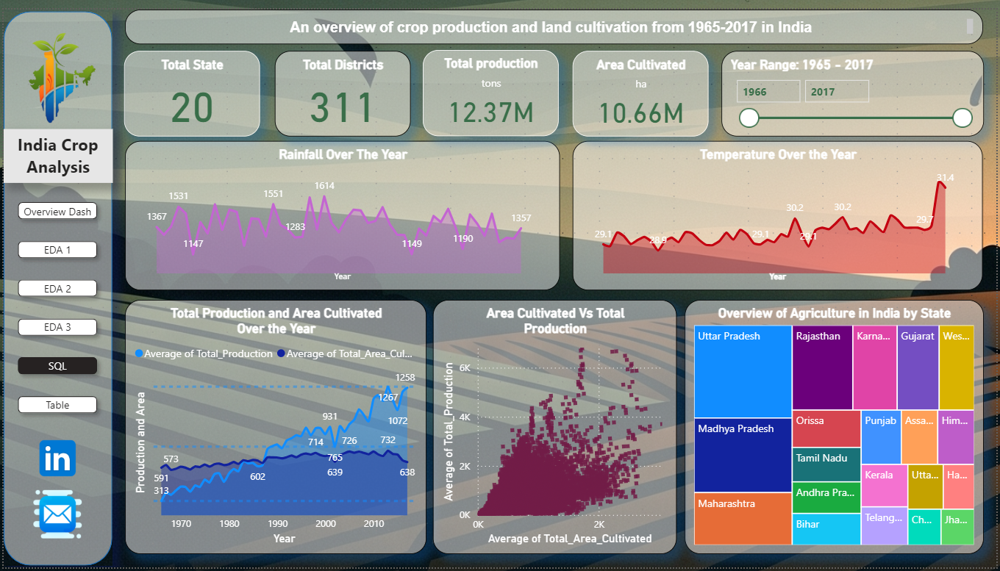

# AgriData Explorer: Understanding Indian Agriculture with EDA

## 📖 Overview

This project aims to analyze and visualize agricultural data across various states and districts of India. By integrating datasets on crop production, rainfall, and temperature, the project provides valuable insights for farmers, policymakers, and researchers. The goal is to create a comprehensive data visualization platform that highlights trends, identifies regional disparities, and supports informed decision-making in the agricultural sector.

## 🎯 Problem Statement

India's agricultural sector is vital to its economy, but managing agricultural data is a significant challenge. The data is often complex, fragmented, and not easily accessible. This makes it difficult for stakeholders like farmers, policymakers, and researchers to access and analyze the information needed to make critical decisions. This project addresses this gap by creating a unified platform to explore and understand agricultural trends in India.

## 💼 Business Use Cases

### For Farmers:

* **Crop Selection:** Analyze historical crop production and yield data to make informed decisions about which crops to plant in different seasons.
* **Productivity Improvement:** Identify regional productivity trends to discover opportunities for improving soil health, irrigation, and other farming practices.

### For Policymakers:

* **Targeted Interventions:** Use data-driven insights to identify regions that need agricultural support and develop effective policies for subsidies, irrigation projects, and other interventions.
* **Food Security:** Monitor crop production and distribution to ensure food security and price stability across the country.

### For Researchers:

* **Trend Analysis:** Access and analyze comprehensive agricultural data to study long-term trends, the impact of climate change, and other factors affecting agriculture.
* **Data-Driven Research:** Use the integrated dataset to support research on crop modeling, yield prediction, and other agricultural studies.

## 🛠️ Skills and Technologies Used

* **Programming:** Python
* **Data Manipulation and Analysis:** Pandas, NumPy
* **Database:** MySQL
* **Data Visualization:** Power BI, Matplotlib, Seaborn
* **Development Environment:** Visual Studio Code, Jupyter Notebook
* **Version Control:** Git and GitHub

## 📂 Project Structure

    ├── data
    │   ├── IndiaCropData.csv
    │   ├── IndiaRainFall.csv
    │   └── indiatemp.csv
    ├── .env
    ├── .mysql_config
    ├── Analyze.sql
    ├── India_crop_power_Bi.pbix
    ├── Processdata.py
    ├── sqlconn.py
    ├── requirements.txt
    └── visual.ipynb

## ⚙️ Setup and Installation

1.  **Clone the repository:**
    ```
    git clone https://github.com/arun8nov/India-AgriData
    ```
2.  **Create a virtual environment:**
    ```
    python -m venv venv
    # On Windows
    venv\Scripts\activate
    # On macOS/Linux
    source venv/bin/activate
    ```
3.  **Install the required libraries:**
    ```
    pip install -r requirements.txt
    ```
4.  **Set up database credentials:**
    * Create a `.env` or `.mysql_config` file in the root directory.
    * Add your MySQL database credentials as follows:
        ```
        HOST=your_host
        USER=your_user
        PASSWORD=your_password
        ```

## 🚀 How to Run the Project

1.  **Data Processing:**
    * Run the `Processdata.py` script to read the datasets from local storage, clean the data, and save the cleaned files.
    ```
    python Processdata.py
    ```
2.  **Database Setup:**
    * Execute the `sqlconn.py` script to connect to the MySQL server, create a new database, and upload the cleaned datasets into it.
    ```
    python sqlconn.py
    ```
3.  **Exploratory Data Analysis (EDA):**
    * Open and run the `visual.ipynb` Jupyter Notebook to see the EDA of the Indian agricultural dataset.
    * Use the queries in the `Analyze.sql` file to perform EDA directly on the MySQL server.
4.  **Power BI Dashboard:**
    * Open the `India_crop_power_Bi.pbix` file in Power BI Desktop to view the interactive dashboards created for in-depth analysis of the datasets.

## ✨ Key Analysis from `Analyze.sql`

The `Analyze.sql` file contains several queries to explore the data, including:

* **Year-wise Trend of Rice Production:** Identifies the top 3 states in rice production for each year.
* **Top Districts by Wheat Yield:** Ranks the top 5 districts by wheat yield increase over the last 5 years.
* **Oilseed Production Growth:** Calculates the 5-year growth rate in oilseed production for each state.
* **Annual Average Maize Yield:** Determines the average maize yield across all states for each year.
* **Total Area for Oilseeds:** Calculates the total area cultivated for oilseeds in each state.

## 📊 Power BI Visualization

The Power BI dashboard provides a comprehensive and interactive view of the data. It includes multiple dashboards that allow for clear analysis of:

* Crop production trends over the years.
* The relationship between rainfall, temperature, and crop yields.
* State-wise and district-wise agricultural performance.



## Author

*   **Arunprakash B**